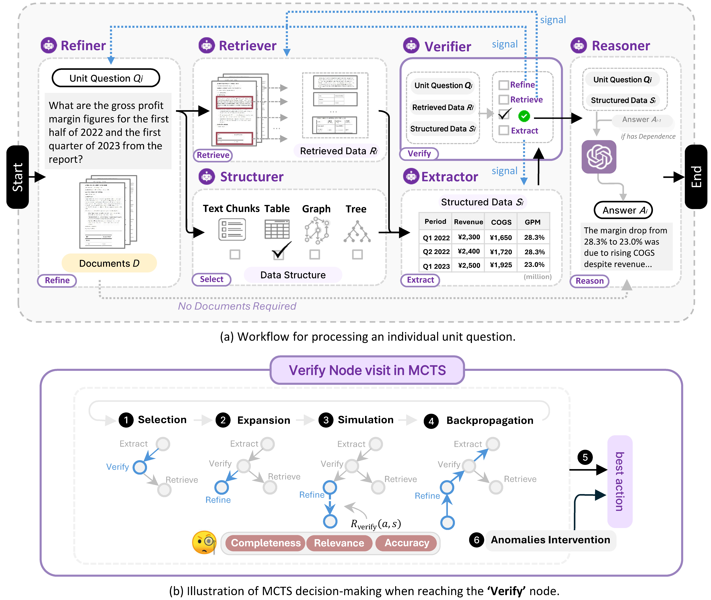

# CycleIE: Iterative Document Information Extraction

**Paper:** *CycleIE: Robust Document Information Extraction through Iterative Verification and Refinement* — Findings of EMNLP 2026

CycleIE treats document information extraction as a closed-loop search problem:
it decomposes questions, retrieves evidence, selects a structure, extracts the
answer, and verifies the result. MCTS chooses the next action, while intervention
resolves verification deadlocks through question refinement or evidence-based
reasoning.

This repository includes the algorithm core (`cycleie/`), Flask + SSE backend,
React + TypeScript frontend, and Loong evaluation harness.

---

## 📄 Paper

Zhengxuan Zhang, Yin Wu, Zhuowen Liang, Haixun Wang, Yuyu Luo, and Nan Tang.
*CycleIE: Robust Document Information Extraction through Iterative Verification
and Refinement.* Findings of the Association for Computational Linguistics:
EMNLP, 2026.

---

## ✨ Key Features

- **Closed-loop extraction.** A Retrieve → Structure → Extract → Verify → Reason
  cycle, where the verifier can send control back to retrieval (wrong evidence)
  or extraction (wrong parse) rather than accepting a bad result.
- **MCTS action selection.** The controller runs `MCTS_SIMULATIONS` rollouts per
  decision and scores candidates with `R = R_base + R_verify − R_cycle − R_penalty`,
  so expensive actions like re-extraction and question refinement are only taken
  when they are likely to pay off.
- **Deadlock intervention.** When the loop revisits the same verification
  failure, the controller either reformulates or splits the unit question, or —
  once the refinement budget is spent — answers with the evidence in hand
  instead of looping forever.
- **Structure-aware extraction.** The Structurer picks between Text Chunk, Tree,
  Table, and Graph per unit question, and the Extractor emits the matching
  representation.
- **Two retrieval modes.** Long-context retrieval through `qwen-long`, or dense
  FAISS retrieval over local RoBERTa embeddings, with a two-stage fallback that
  searches the full corpus only after verifier scores drop below threshold.
- **Built-in ablations.** `variant="wo_verify"` and `variant="wo_extract"`
  reproduce the ablation rows of the paper without touching the code.
- **Full-stack demo.** A React UI for uploading documents, running questions per
  project, watching the agent trail stream live, and toggling CycleIE off to
  compare against a one-pass baseline.

---

## 📁 Repository Layout

```
CycleIE/
├── cycleie/                        # Core Python library
│   ├── __init__.py                 # Public API: run_cycleie, stream_cycleie, stream_direct_qa
│   ├── config.py                   # Fixed MCTS / verifier / model hyper-parameters
│   │
│   ├── agents/                     # Planner, six loop agents, and the controller
│   │   ├── base_agent.py           # Abstract agent with thought-trail helpers
│   │   ├── controller.py           # WorkflowController: ReAct loop + MCTS + intervention
│   │   ├── planner_agent.py        # Splits a complex query into unit questions
│   │   ├── retriever_agent.py      # Long-context or FAISS retrieval of document segments
│   │   ├── structurer_agent.py     # Chooses Text Chunk / Tree / Table / Graph
│   │   ├── extractor_agent.py      # Extracts into the chosen structure; re-extracts on feedback
│   │   ├── verifier_agent.py       # Scores completeness / relevance / accuracy, emits signals
│   │   ├── refiner_agent.py        # Reformulates or splits a stuck unit question
│   │   └── reasoner_agent.py       # Intermediate answers + final answer synthesis
│   │
│   ├── core/
│   │   ├── state.py                # CycleIEState: shared reasoning state and thought trail
│   │   ├── document_manager.py     # Loading, chunking, and FAISS indexing of documents
│   │   └── workflow.py             # run_cycleie / stream_cycleie / stream_direct_qa
│   │
│   ├── embeddings/
│   │   └── roberta_embeddings.py   # LangChain-compatible RoBERTa embeddings for FAISS
│   │
│   ├── llm/
│   │   └── client.py               # OpenAI-compatible chat client with retries
│   │
│   └── utils/
│       ├── mcts.py                 # MCTSNode: visits, value, UCT backpropagation
│       ├── json_utils.py           # Tolerant JSON extraction from LLM output
│       └── text_utils.py           # Language detection and content-length helpers
│
├── app/
│   ├── backend/                    # Flask demo API
│   │   ├── app.py                  # All HTTP routes; SSE streaming for /api/process
│   │   ├── run.py                  # Server launcher (--host, --port, --debug)
│   │   ├── workspace.py            # Per-project workspace layout and public file library
│   │   ├── chat_store.py           # JSON conversation persistence
│   │   └── formulas.py             # LaTeX delimiter normalization for KaTeX
│   │
│   └── frontend/                   # React + TypeScript SPA
│       ├── public/
│       └── src/
│           ├── App.tsx             # Workspace UI: documents, chat, workflow panel, settings
│           ├── components/
│           │   ├── Router.tsx      # Home ↔ project tab routing
│           │   ├── HomePage.tsx    # Project dashboard (create / edit / delete / search)
│           │   ├── FileLibraryWithUpload.tsx   # Upload, select, delete, index reload
│           │   ├── ChatMessages.tsx            # Markdown + KaTeX + structured rendering
│           │   ├── ChatHistoryPanel.tsx        # Conversation list
│           │   ├── WorkflowViewer.tsx          # Collapsible thinking-process panel
│           │   ├── ReActProcessor.tsx          # Parses agent tags into thought steps
│           │   ├── LiveThinkingRenderer.tsx    # Live streaming thought display
│           │   ├── StructuredContentRenderer.tsx
│           │   ├── TripletGraphViewer.tsx      # Interactive (S,P,O) graph view
│           │   └── TreeViewer.tsx              # Collapsible tree view
│           └── styles/
│
├── examples/
│   ├── quickstart.py               # Answer one question over local documents
│   └── evaluate_loong.py           # Batch evaluation on the Loong benchmark
│
├── tests/
│   └── test_controller.py          # MCTS reward, action selection, intervention, ablations
│
├── figs/
│   └── framework.jpg               # Paper framework figure
│
├── pyproject.toml                  # Package metadata (Python >= 3.9)
├── requirements.txt
├── .env.example                    # Copy to .env and fill in your keys
└── LICENSE                         # MIT
```

---

## 🚀 Quick Start

### Prerequisites

- Python **3.9+**
- Node.js **18+** and npm (only for the demo UI)
- One LLM API key (any OpenAI-compatible endpoint, or Qwen/DashScope)

A GPU is helpful but not required — the dense index runs on a local RoBERTa
model, and `faiss-cpu` with CPU PyTorch is enough to try everything here.

### 1. Install

```bash
cd CycleIE
python3 -m venv .venv && source .venv/bin/activate
pip install -e .
```

### 2. Configure credentials

```bash
cp .env.example .env
```

Every generation agent uses the same backbone. The paper uses
Qwen2-72B-Instruct, and the long-context retriever uses Qwen-Long. Model names
starting with `qwen` are routed to `QWEN_BASE_URL`; everything else goes to
`OPENAI_BASE_URL`.

```env
QWEN_BASE_URL=https://dashscope.aliyuncs.com/compatible-mode/v1
QWEN_API_KEY=sk-...
OPENAI_BASE_URL=https://api.openai.com/v1
OPENAI_API_KEY=sk-...
```

### 3. Ask a question

```bash
python examples/quickstart.py \
  --docs report.pdf notes.md \
  --query "What changed between the two filings?" \
  --stream
```

| Flag | Default | Description |
|---|---|---|
| `--docs` | *(required)* | One or more document paths |
| `--query` | *(required)* | The analytical question |
| `--model` | configured default | Backbone model for all agents |
| `--stream` | off | Print the thought trail as it is produced |

### 4. Or use it as a library

```python
from cycleie import run_cycleie

result = run_cycleie(
    query="What changed between the two filings?",
    documents=["report.pdf", "notes.md"],
)
print(result["answer"])
print(result["thought_process"])
```

`run_cycleie(query, documents, doc_mode="paths", model=None, custom_params=None, callback=None, variant="full")`

| Parameter | Default | Description |
|---|---|---|
| `documents` | *(required)* | File paths, or raw text with `doc_mode="contents"` |
| `doc_mode` | `"paths"` | `"paths"` or `"contents"` |
| `model` | `None` | Backbone for all agents; `None` uses `qwen2-72b-instruct` |
| `custom_params` | `None` | Extra `DocumentManager` kwargs, or `{"doc_manager": ...}` to reuse an index |
| `callback` | `None` | Called with each thought as it is produced |
| `variant` | `"full"` | `"full"`, `"wo_verify"`, or `"wo_extract"` |

`stream_cycleie` takes the same arguments and yields thoughts incrementally,
with the final chunk prefixed by `FINAL ANSWER: `. `stream_direct_qa` is the
one-pass baseline that skips the loop entirely.

---

## 🖥️ Demo

Two processes, from the repository root.

```bash
python app/backend/run.py
```

```bash
cd app/frontend && npm install && npm start
```

The UI is at `http://localhost:3000` and talks to the API on port 5000. Create a
project, upload documents, and toggle CycleIE off to compare against the
one-pass baseline. Allowed CORS origins can be overridden with
`CYCLEIE_ALLOWED_ORIGINS`.

Supported upload formats: `pdf`, `txt`, `md`, `csv`, `xlsx`, `xls`.

---

## 🧩 Architecture in One Picture

<p align="center">
  
</p>

The figure is the paper's overview for **one unit question**. The upper panel is
the extraction loop; the lower panel is how the next action is chosen. A
multi-question task is an optional Planner step in front of this loop: it
splits the task into unit questions, and each one runs the figure once.

**The loop.** A unit question \(Q_i\) is answered over the document collection
\(D\). The Retriever pulls the relevant segments (Retrieved Data \(R_i\)). The
Structure Selector then picks one representation \(D_s\) — text chunks, table,
graph, or tree — and the Extractor turns \(R_i\) into structured data \(S_i\) in
that form. The Verifier reads \(Q_i\), \(R_i\), and \(S_i\) together and scores
completeness, relevance, and accuracy. It does not always accept the result. It
emits one of three signals:

- **Re-retrieve** sends the loop back to the Retriever when the segments are
  incomplete or off-target.
- **Refine** sends it back to the Extractor when the segments are fine but the
  structured form is not.
- **Replan** sends it back to the unit question itself, to reformulate or split
  a question that will not retrieve the right evidence.

When verification passes, the Reasoner writes the intermediate answer \(A_i\).
If a later question depends on that answer, \(A_{i-1}\) is carried in directly
and no further documents are required.

**Choosing the next action.** None of those arrows is a fixed edge. The lower
panel is the controller: from the current verify node it runs Monte Carlo Tree
Search — selection, expansion, simulation, backpropagation — and takes the most
visited child as the next action. Simulation scores a path by verification
quality (completeness, relevance, accuracy) minus the cost of repeating a cycle
or of an expensive action such as refine or replan. **Anomalies intervention**
overrides that choice when the loop is stuck on the same verification failure:
it replans the question while the refinement budget lasts, and otherwise cuts
to reasoning on the evidence already in hand.

---

## 🧪 Evaluation

`examples/evaluate_loong.py` follows the paper's Loong protocol. Retrieval starts
from the question's evidence documents and searches the full document set only
after the verifier's average of completeness and relevance falls below 2.

```bash
python examples/evaluate_loong.py --loong-dir /path/to/Loong --output ./results
python examples/evaluate_loong.py --loong-dir /path/to/Loong --variant wo_verify
```

| Flag | Default | Description |
|---|---|---|
| `--loong-dir` | *(required)* | Root of the Loong release |
| `--questions` | `loong.jsonl` | Question file inside `--loong-dir` |
| `--output` | `./results` | Per-question JSON output directory |
| `--model` | configured default | CycleIE backbone |
| `--judge-model` | `gpt-4` | LLM judge |
| `--variant` | `full` | `full`, `wo_verify`, or `wo_extract` |
| `--limit` | all | Evaluate only the first N questions |

Metrics: **LLM** is the mean judge rating (0–100), **EM** is the fraction of
answers scoring exactly 100. Overall is the instance-weighted average, not an
unweighted mean across task types. Per-question results are cached under
`{output}/{variant}/{id}.json`, so an interrupted run resumes where it stopped.

The [Loong](https://github.com/MozerWang/Loong) release is expected at
`<loong-dir>/loong.jsonl`, with evidence at
`<loong-dir>/data/evidence/data_<id>.json`. No benchmark data is bundled in this
repository.

---

## 🔌 REST API (highlights)

Most routes have both a default-workspace form and a project-scoped form under
`/api/projects/<project_id>/...`.

| Endpoint | Purpose |
|---|---|
| `POST /api/process` | Answer a query; streams the reasoning trail over SSE |
| `POST /api/upload` · `POST /api/upload/batch` | Upload one or more documents |
| `GET /api/files` · `POST /api/files/delete` | List and delete documents |
| `GET /api/files/content` | Fetch a document's text content |
| `POST /api/reload-index` | Rebuild the FAISS index for the workspace |
| `GET /api/chat/history` · `GET /api/chat/history/<chat_id>` | List and load conversations |
| `POST /api/chat/new` · `POST /api/chat/rename/<chat_id>` · `DELETE /api/chat/delete/<chat_id>` | Manage conversations |
| `POST /api/chat/edit/<chat_id>/<message_index>` | Edit a message and truncate the history after it |
| `GET/POST/PUT/DELETE /api/projects` | Project management |
| `GET /api/public-files` · `POST /api/public-files/import` | Browse and import bundled sample documents |
| `GET/POST /api/settings` | Read and update the active model and API credentials |

`POST /api/process` responds with `text/event-stream` and emits `start`,
`thinking`, `answer`, and `end` events. There is no WebSocket channel.

---

## ✅ Tests

```bash
python -m unittest tests.test_controller
```

Covers MCTS backpropagation, the reward decomposition, action selection under
each verifier signal, deadlock intervention, the refinement budget, and the two
ablation transition tables.

---

## 📦 What is *not* included (by design)

- `app/backend/uploads/`, `chat_history/`, `faiss_index/`, `projects/` — runtime artifacts
- `app/frontend/node_modules/`, `build/` — install and build outputs
- `.env` — your private credentials (only `.env.example` is shipped)
- `results/` — evaluation output

These paths are pre-listed in `.gitignore`.

---

## 📜 License

Released under the MIT License. See [LICENSE](LICENSE).

---

## 📝 Citation

```bibtex
@inproceedings{zhang2026cycleie,
  title = {CycleIE: Robust Document Information Extraction through Iterative Verification and Refinement},
  author = {Zhang, Zhengxuan and Wu, Yin and Liang, Zhuowen and Wang, Haixun and Luo, Yuyu and Tang, Nan},
  booktitle = {Findings of the Association for Computational Linguistics: EMNLP},
  year = {2026}
}
```
